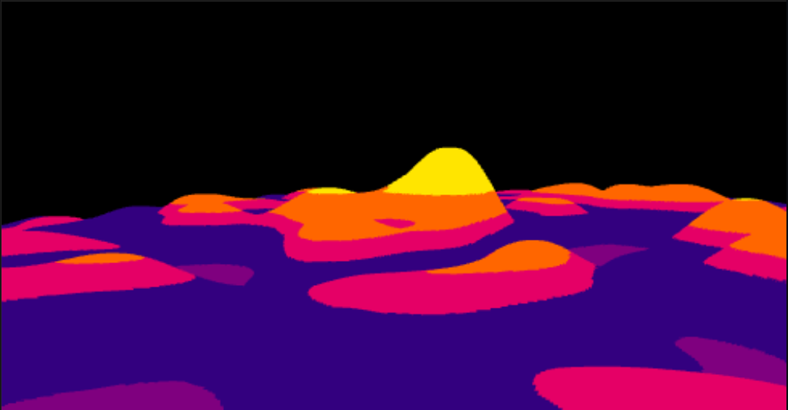

## Vox

Vox is a WebGL / GLSL-based visual project that renders a colorful, voxel-style landscape, as shown below.

### Technologies used

- **Build tool**: Vite 5 (`vite`)
- **Language**: JavaScript (ES modules)
- **Shaders**: GLSL via `vite-plugin-glsl`
- **Math / utilities**:
  - `gl-matrix` for matrix and vector math
  - `math.js` for additional math utilities
  - `noise-ts` / `noisejs` for procedural noise

### Visual effect

- **Terrain**: a procedurally generated terrain mesh (`Terrain` in `Model.js`) built using noise functions, rendered as a colorful, voxel-like landscape.
- **Color**: vertex colors are passed into the vertex shader and written straight out in the fragment shader, producing the banded color look in the preview image.
- **Camera**: a free-flying first-person camera built with `gl-matrix`, controlled by keyboard and mouse, looking over the terrain.

### Controls

- **Enter pointer lock**: click on the canvas once to capture the mouse.
- **Look around**: move the mouse (while pointer is locked).
- **Move forward / backward**: `W` / `S`
- **Strafe left / right**: `A` / `D`
- **Move up / down**: `Space` / `Left Shift`

If you lose control, press `Esc` to exit pointer lock in the browser and click the canvas again to re-enter.

### Configuration options

You can tweak a few simple constants in `src/main.js`:

- **`movementSpeed`**: controls how fast the camera moves (`0.1` by default).
- **`yaw` / `pitch`**: initial camera orientation (in degrees).
- **`mouseSensitivity`**: how responsive mouse look feels (`0.05` by default).

And in `Model.js` (the `Terrain` constructor), you can change parameters such as the terrain size / resolution to experiment with different landscapes.

### Getting started (development)

1. **Clone the repo**
   - `git clone <this-repo-url>`
   - `cd vox`
2. **Install dependencies**
   - With npm: `npm install`
   - Or with another compatible package manager if you prefer.
3. **Start the dev server**
   - `npm run dev`
